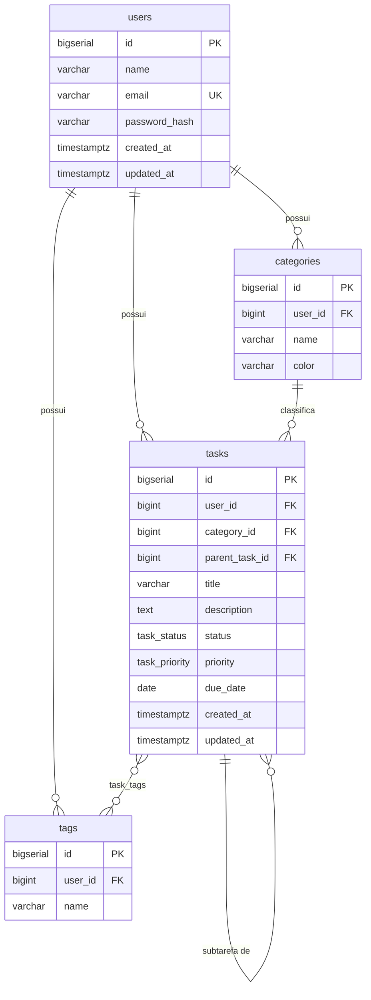

# Task API

API REST de gerenciamento de tarefas (to-do list) com autenticação JWT, construída em Java 25 e Spring Boot 4.


> **Status:** em desenvolvimento. O módulo de usuários está funcional e testado; tarefas, categorias e tags estão em construção. O roadmap completo, com o que já foi entregue, está no final deste documento.

---

## Sobre o projeto

Uma API de to-do list que vai além do CRUD básico. Cada usuário tem seu próprio espaço de categorias, tags e tarefas, com suporte a subtarefas, prioridades e prazos.

O projeto foi construído do zero, sem geradores de código ou scaffolding, com o objetivo de exercitar a fundo modelagem relacional, o mapeamento objeto-relacional do JPA/Hibernate e autenticação stateless com JWT. As escolhas técnicas estão documentadas e justificadas na seção [Decisões técnicas](#decisões-técnicas).

---

## Stack

| Camada | Tecnologia |
|---|---|
| Linguagem | Java 25 (LTS) |
| Framework | Spring Boot 4.1.0 |
| Persistência | Spring Data JPA + Hibernate 7.4.1 |
| Banco de dados | PostgreSQL 18 |
| Segurança | Spring Security + BCrypt, JWT (em implementação) |
| Validação | Jakarta Bean Validation |
| Build | Maven |
| Documentação | OpenAPI / Swagger UI (planejado) |

---

## Funcionalidades

- Cadastro de usuários com senha criptografada em BCrypt
- Categorias e tags com escopo por usuário — cada um enxerga apenas as suas
- Tarefas com título, descrição, status, prioridade e data de vencimento
- Subtarefas com **um único nível de aninhamento**, garantido pelo próprio banco
- Relacionamento N:N entre tarefas e tags
- Tratamento centralizado de erros com respostas padronizadas
- Autenticação stateless via JWT *(em implementação)*

---

## Modelagem do banco



O schema usa tipos `ENUM` nativos do PostgreSQL para `status` e `priority`, índices parciais para as consultas mais frequentes e uma *trigger* que mantém a coluna `updated_at` sempre atualizada.

---

## Decisões técnicas

Esta seção existe porque o "porquê" costuma valer mais do que o código em si.

**Entidades JPA sem Lombok.** Getters, setters e construtores foram escritos à mão. Lombok em entidades bidirecionais gera `equals`, `hashCode` e `toString` que percorrem os dois lados do relacionamento, causando recursão infinita e disparando *lazy loading* fora da sessão. DTOs, esses sim, são `record` — imutáveis e sem boilerplate.

**Aninhamento de subtarefas limitado por trigger, não por CHECK.** A regra "uma subtarefa não pode ter subtarefas" exige consultar o `parent_task_id` da tarefa-pai, ou seja, uma subquery. O PostgreSQL não permite subqueries em constraints `CHECK`, então a regra virou uma *trigger* `BEFORE INSERT OR UPDATE`. A validação vive no banco, e não apenas na aplicação.

**`created_at` gerado pelo banco.** Mapeado com `@Generated(event = EventType.INSERT)`, para que o Hibernate leia de volta o valor produzido pelo `DEFAULT now()` em vez de sobrescrevê-lo com o relógio da JVM.

**Spring Security introduzido cedo, mas desativado.** A dependência entrou apenas para usar o `BCryptPasswordEncoder`. Até a fase de JWT, o `SecurityConfig` mantém `permitAll`, com `formLogin` e `httpBasic` desabilitados e a autoconfiguração de `UserDetailsService` excluída — evitando que endpoints em desenvolvimento fiquem trancados atrás de um login padrão.

**Escopo por usuário no nível do schema.** Categorias e tags carregam `user_id` com `UNIQUE (user_id, name)`, o que impede colisão de nomes entre usuários sem depender de checagem na camada de serviço.

---

## Estrutura do projeto

```
src/main/java/com/thiago/taskapi/task_api/
├── config/        # Configuração do Spring Security
├── controller/    # Endpoints REST
├── dto/           # Records de request e response
├── exception/     # Exceções de domínio e @RestControllerAdvice
├── model/         # Entidades JPA
│   └── enums/     # Status e prioridade
├── repository/    # Interfaces Spring Data JPA
└── service/       # Regras de negócio
```

---

## Endpoints

### Usuários

| Método | Rota | Descrição | Status |
|---|---|---|---|
| `POST` | `/users` | Cria um usuário | ✅ |
| `GET` | `/users` | Lista os usuários | ✅ |
| `GET` | `/users/{id}` | Busca um usuário por id | ✅ |

### Tarefas, categorias e tags

| Método | Rota | Descrição | Status |
|---|---|---|---|
| `POST` | `/categories` | Cria uma categoria | 🚧 |
| `GET` | `/categories` | Lista as categorias do usuário | 🚧 |
| `POST` | `/tags` | Cria uma tag | 🚧 |
| `GET` | `/tags` | Lista as tags do usuário | 🚧 |
| `POST` | `/tasks` | Cria uma tarefa | 🚧 |
| `GET` | `/tasks` | Lista as tarefas do usuário | 🚧 |
| `GET` | `/tasks/{id}` | Busca uma tarefa por id | 🚧 |
| `PUT` | `/tasks/{id}` | Atualiza uma tarefa | 🚧 |
| `DELETE` | `/tasks/{id}` | Remove uma tarefa | 🚧 |

### Autenticação

| Método | Rota | Descrição | Status |
|---|---|---|---|
| `POST` | `/auth/login` | Autentica e devolve o token JWT | 🚧 |

---

## Exemplos de uso

**Criar um usuário**

```bash
curl -X POST http://localhost:8081/users \
  -H "Content-Type: application/json" \
  -d '{
    "name": "Thiago",
    "email": "thiago@example.com",
    "password": "senhaSegura123"
  }'
```

```json
HTTP/1.1 201 Created

{
  "id": 1,
  "name": "Thiago",
  "email": "thiago@example.com",
  "createdAt": "2026-07-22T14:03:11.482Z"
}
```

**Resposta de erro padronizada**

```json
HTTP/1.1 404 Not Found

{
  "status": 404,
  "error": "Not Found",
  "message": "Usuário não encontrado com id 99",
  "timestamp": "2026-07-22T14:05:27.910Z"
}
```

---

## Como executar

### Pré-requisitos

- JDK 25
- PostgreSQL 18
- Maven 3.9+

### Passo a passo

```bash
# 1. Clonar o repositório
git clone https://github.com/<seu-usuario>/task-api.git
cd task-api

# 2. Criar o banco
createdb taskapi

# 3. Aplicar o schema
psql -d taskapi -f src/main/resources/db/schema.sql
```

Configure as credenciais em `src/main/resources/application.properties`:

```properties
spring.datasource.url=jdbc:postgresql://localhost:5432/taskapi
spring.datasource.username=seu_usuario
spring.datasource.password=sua_senha
spring.jpa.hibernate.ddl-auto=validate
server.port=8081
```

```bash
# 4. Subir a aplicação
mvn spring-boot:run
```

A API sobe em `http://localhost:8081`.

---

## Roadmap

| # | Fase | Status |
|---|---|---|
| 1 | Setup do projeto | ✅ |
| 2 | Modelagem do banco | ✅ |
| 3 | Entidades JPA | ✅ |
| 4 | Repositories | ✅ |
| 5 | DTOs | ✅ |
| 6 | Services | 🚧 |
| 7 | Controllers | 🚧 |
| 8 | Validação | ⬜ |
| 9 | Segurança com JWT | ⬜ |
| 10 | Testes e documentação (Swagger) | ⬜ |
| 11 | Front-end de vitrine *(opcional)* | ⬜ |

---

## Autor

**Thiago**

[](https://github.com/ThiagoHeckler)
[](https://www.linkedin.com/in/thiago-heckler/)

---

## Licença

Distribuído sob a licença MIT. Veja `LICENSE` para mais detalhes.
