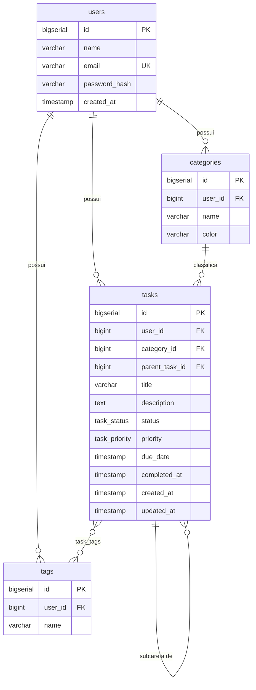

# Task API

API REST de gerenciamento de tarefas (to-do list) com autenticação JWT, construída em Java 25 e Spring Boot 4.


> **Status:** em desenvolvimento. O CRUD de usuários, categorias, tags e tarefas está completo e protegido por autenticação JWT. Os próximos passos são documentação com Swagger e deploy. O roadmap completo está no final deste documento.

---

## Sobre o projeto

Uma API de to-do list que vai além do CRUD básico. Cada usuário tem seu próprio espaço de categorias, tags e tarefas, com suporte a subtarefas, prioridades e prazos.

O projeto foi construído do zero, sem geradores de código ou scaffolding, com o objetivo de exercitar a fundo modelagem relacional, o mapeamento objeto-relacional do JPA/Hibernate e autenticação stateless com JWT. As escolhas técnicas estão documentadas e justificadas na seção [Decisões técnicas](#decisões-técnicas).

---

## Stack

| Camada | Tecnologia |
|---|---|
| Linguagem | Java 25 (LTS) |
| Framework | Spring Boot 4.1.0 |
| Persistência | Spring Data JPA + Hibernate 7.4.1 |
| Banco de dados | PostgreSQL 18 (via Docker Compose) |
| Segurança | Spring Security, BCrypt, JWT (JJWT 0.12.6) |
| Validação | Jakarta Bean Validation |
| Build | Maven |
| Documentação | OpenAPI / Swagger UI (planejado) |

---

## Funcionalidades

- Cadastro de usuários com senha criptografada em BCrypt
- Login com e-mail e senha, devolvendo um token JWT válido por 1 hora
- Todas as rotas (exceto cadastro e login) exigem o token; o usuário é identificado pelo próprio token
- Categorias e tags com escopo por usuário — cada um enxerga apenas as suas
- Tarefas com título, descrição, status, prioridade e data de vencimento
- Subtarefas com **um único nível de aninhamento**, garantido pelo próprio banco
- Relacionamento N:N entre tarefas e tags
- Tratamento centralizado de erros com respostas padronizadas, inclusive 401 e 403

---

## Modelagem do banco


```mermaid
erDiagram
    users ||--o{ categories : possui
    users ||--o{ tags : possui
    users ||--o{ tasks : possui
    categories ||--o{ tasks : classifica
    tasks ||--o{ tasks : "subtarefa de"
    tasks }o--o{ tags : task_tags

    users {
        bigserial id PK
        varchar name
        varchar email UK
        varchar password_hash
        timestamp created_at
    }
    categories {
        bigserial id PK
        bigint user_id FK
        varchar name
        varchar color
    }
    tags {
        bigserial id PK
        bigint user_id FK
        varchar name
    }
    tasks {
        bigserial id PK
        bigint user_id FK
        bigint category_id FK
        bigint parent_task_id FK
        varchar title
        text description
        task_status status
        task_priority priority
        timestamp due_date
        timestamp completed_at
        timestamp created_at
        timestamp updated_at
    }
```

O schema usa tipos `ENUM` nativos do PostgreSQL para `status` e `priority`, índices compostos e parciais para as consultas mais frequentes e duas *triggers*: uma limita as subtarefas a um nível e outra mantém a coluna `updated_at` sempre atualizada.

---

## Decisões técnicas

Esta seção existe porque o "porquê" costuma valer mais do que o código em si.

**Entidades JPA sem Lombok.** Getters, setters e construtores foram escritos à mão. Lombok em entidades bidirecionais gera `equals`, `hashCode` e `toString` que percorrem os dois lados do relacionamento, causando recursão infinita e disparando *lazy loading* fora da sessão. DTOs, esses sim, são `record` — imutáveis e sem boilerplate.

**Aninhamento de subtarefas limitado por trigger, não por CHECK.** A regra "uma subtarefa não pode ter subtarefas" exige consultar o `parent_task_id` da tarefa-pai, ou seja, uma subquery. O PostgreSQL não permite subqueries em constraints `CHECK`, então a regra virou uma *trigger* `BEFORE INSERT OR UPDATE`. A validação vive no banco, e não apenas na aplicação.

**`created_at` gerado pelo banco.** Mapeado com `@Generated(event = EventType.INSERT)`, para que o Hibernate leia de volta o valor produzido pelo `DEFAULT now()` em vez de sobrescrevê-lo com o relógio da JVM.

**Escopo por usuário no nível do schema.** Categorias e tags carregam `user_id` com `UNIQUE (user_id, name)`, o que impede colisão de nomes entre usuários sem depender de checagem na camada de serviço.

**Usuário vem do token, nunca da URL.** As rotas são `/tasks`, `/categories` e `/tags`, sem `{userId}`. O filtro JWT coloca o id do usuário no `SecurityContext` e os controllers o recebem com `@AuthenticationPrincipal`. Assim não existe forma de um usuário pedir os dados de outro trocando um número na URL.

**404 em vez de 403 para recursos de outro usuário.** Toda busca é feita por `id` *e* `user_id`. Pedir a tarefa de outra pessoa devolve 404, como se ela não existisse — um 403 confirmaria que aquele id existe.

**Login sem revelar quais e-mails estão cadastrados.** E-mail inexistente e senha errada devolvem a mesma resposta 401. Além da mensagem, o tempo também é igual: quando o e-mail não existe, o BCrypt roda contra um hash falso, para que a resposta não seja mais rápida e denuncie o caso.

**Erros de segurança no mesmo formato dos demais.** O 401 e o 403 acontecem nos filtros, antes de a requisição chegar ao controller, onde o `@RestControllerAdvice` não alcança. Por isso um `AuthenticationEntryPoint` e um `AccessDeniedHandler` próprios escrevem o mesmo JSON de `ErrorResponse`.

**Sem refresh token (limitação consciente).** O token expira em 1 hora e o cliente precisa logar de novo. O filtro também não consulta o banco a cada requisição, então o token de um usuário excluído continua válido até expirar — as operações dele passam a devolver 404.

---

## Estrutura do projeto

```
src/main/java/com/thiago/taskapi/task_api/
├── config/        # Configuração do Spring Security
├── controller/    # Endpoints REST
├── dto/           # Records de request e response
├── exception/     # Exceções de domínio e @RestControllerAdvice
├── model/         # Entidades JPA
│   └── enums/     # Status e prioridade
├── repository/    # Interfaces Spring Data JPA
├── security/      # JwtService, filtro JWT e respostas 401/403
└── service/       # Regras de negócio
```

---

## Endpoints

Exceto onde indicado, todas as rotas exigem o header `Authorization: Bearer <token>`.

### Autenticação

| Método | Rota | Descrição | Autenticação |
|---|---|---|---|
| `POST` | `/auth/login` | Autentica e devolve o token JWT | pública |

### Usuários

| Método | Rota | Descrição | Autenticação |
|---|---|---|---|
| `POST` | `/users` | Cria um usuário | pública |
| `GET` | `/users/me` | Dados do usuário autenticado | token |
| `PUT` | `/users/me` | Atualiza o usuário autenticado | token |
| `DELETE` | `/users/me` | Remove o usuário autenticado e todos os seus dados | token |

### Categorias e tags

| Método | Rota | Descrição |
|---|---|---|
| `POST` | `/categories` | Cria uma categoria |
| `GET` | `/categories` | Lista as categorias do usuário |
| `GET` | `/categories/{id}` | Busca uma categoria |
| `PUT` | `/categories/{id}` | Atualiza uma categoria |
| `DELETE` | `/categories/{id}` | Remove uma categoria (as tarefas ficam sem categoria) |
| `POST` | `/tags` | Cria uma tag |
| `GET` | `/tags` | Lista as tags do usuário |
| `GET` | `/tags/{id}` | Busca uma tag |
| `PUT` | `/tags/{id}` | Atualiza uma tag |
| `DELETE` | `/tags/{id}` | Remove uma tag |

### Tarefas

| Método | Rota | Descrição |
|---|---|---|
| `POST` | `/tasks` | Cria uma tarefa (ou subtarefa, com `parentTaskId`) |
| `GET` | `/tasks` | Lista as tarefas do usuário (filtro opcional `?status=`) |
| `GET` | `/tasks/root` | Lista só as tarefas de primeiro nível |
| `GET` | `/tasks/{id}` | Busca uma tarefa |
| `PUT` | `/tasks/{id}` | Atualiza uma tarefa (só os campos enviados) |
| `DELETE` | `/tasks/{id}` | Remove uma tarefa e suas subtarefas |

---

## Exemplos de uso

**1. Criar um usuário**

```bash
curl -X POST http://localhost:8081/users \
  -H "Content-Type: application/json" \
  -d '{"name": "Thiago", "email": "thiago@example.com", "password": "senhaSegura123"}'
```

```json
HTTP/1.1 201 Created

{
  "id": 1,
  "name": "Thiago",
  "email": "thiago@example.com",
  "createdAt": "2026-10-09T12:46:00.301317"
}
```

**2. Fazer login**

```bash
curl -X POST http://localhost:8081/auth/login \
  -H "Content-Type: application/json" \
  -d '{"email": "thiago@example.com", "password": "senhaSegura123"}'
```

```json
HTTP/1.1 200 OK

{
  "token": "eyJhbGciOiJIUzUxMiJ9...",
  "type": "Bearer",
  "expiresIn": 3600
}
```

**3. Criar uma tarefa com o token**

```bash
curl -X POST http://localhost:8081/tasks \
  -H "Authorization: Bearer <token>" \
  -H "Content-Type: application/json" \
  -d '{"title": "Estudar JWT", "priority": "HIGH"}'
```

**Respostas de erro padronizadas**

```json
HTTP/1.1 401 Unauthorized

{
  "timestamp": "2026-10-09T15:34:21.050Z",
  "status": 401,
  "error": "Unauthorized",
  "message": "Autenticação necessária"
}
```

```json
HTTP/1.1 404 Not Found

{
  "timestamp": "2026-10-09T15:46:00.785Z",
  "status": 404,
  "error": "Not Found",
  "message": "Tarefa não encontrada com id: 1"
}
```

---

## Como executar

### Pré-requisitos

- JDK 25
- Docker com Docker Compose

O Maven não precisa estar instalado: o projeto inclui o wrapper `./mvnw`.

### Passo a passo

```bash
# 1. Clonar o repositório
git clone https://github.com/ThiagoHeckler/Task_API.git
cd Task_API

# 2. Subir o PostgreSQL (o schema é aplicado automaticamente na primeira subida)
docker compose up -d

# 3. Criar a configuração local a partir do modelo
cp src/main/resources/applicationExemple.yml src/main/resources/application.yml

# 4. Subir a aplicação
./mvnw spring-boot:run
```

A API sobe em `http://localhost:8081` e o banco fica em `localhost:5440`.

As credenciais do banco e o segredo do JWT podem ser definidos pelas variáveis de ambiente `DB_USER`, `DB_PASSWORD` e `JWT_SECRET`. O segredo precisa ter no mínimo 32 caracteres; o valor padrão do `applicationExemple.yml` serve apenas para desenvolvimento.

Para recomeçar com o banco vazio: `docker compose down -v && docker compose up -d`.

---

## Roadmap

| # | Fase | Status |
|---|---|---|
| 1 | Setup do projeto | ✅ |
| 2 | Modelagem do banco | ✅ |
| 3 | Entidades JPA | ✅ |
| 4 | Repositories | ✅ |
| 5 | DTOs | ✅ |
| 6 | Services e controllers (CRUD completo) | ✅ |
| 7 | Autenticação com JWT | ✅ |
| 8 | Documentação com Swagger / OpenAPI | ⬜ |
| 9 | Deploy | ⬜ |
| 10 | Testes automatizados e polimento | ⬜ |
| 11 | Front-end de vitrine *(opcional)* | ⬜ |

---

## Autor

**Thiago**

[](https://github.com/ThiagoHeckler)
[](https://www.linkedin.com/in/thiago-heckler/)

---

## Licença

Distribuído sob a licença MIT. Veja `LICENSE` para mais detalhes.
